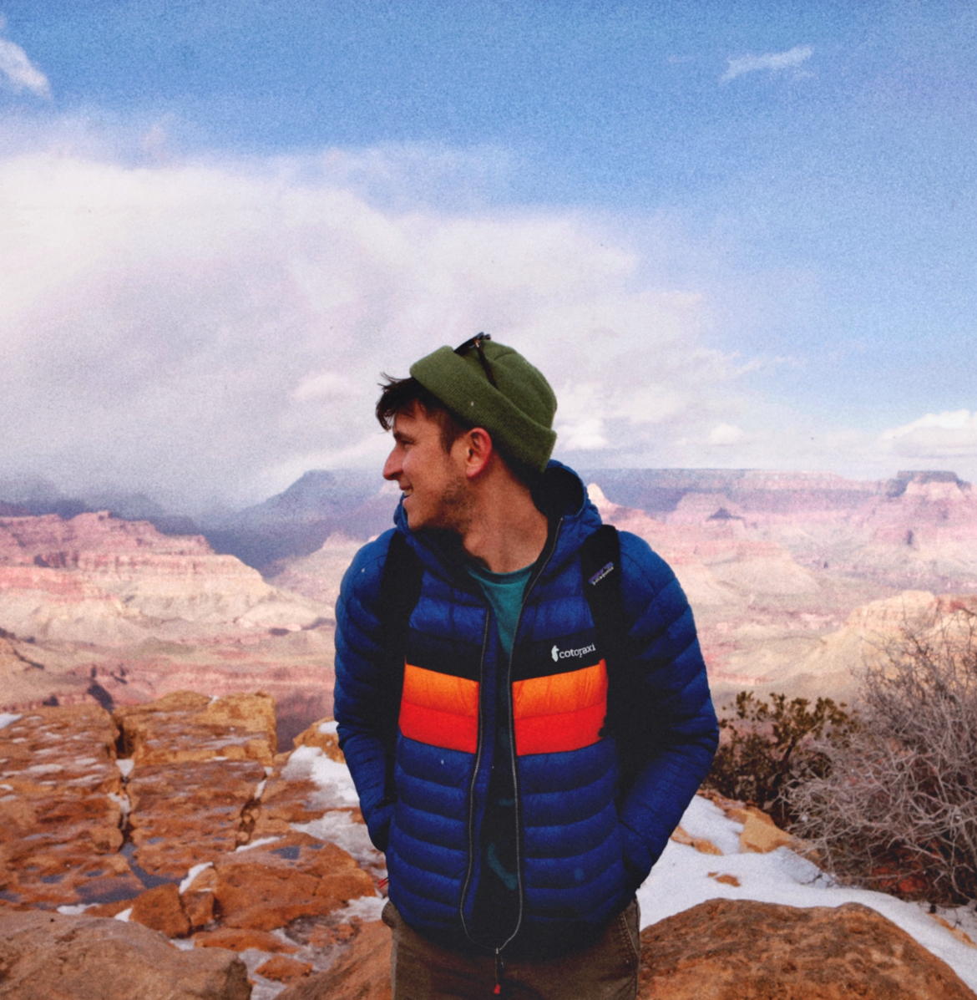

# Meet Our Team

    
    

        <strong>John Doe</strong> 
        Web Developer 
        Enthusiastic about creating beautiful and functional websites.
    

    
    

        <strong>Jane Smith</strong> 
        Graphic Designer 
        Passionate about turning ideas into visually appealing designs.
    

    
    

        <strong>Chris Johnson</strong> 
        Data Scientist 
        Analyzing data to uncover meaningful insights and trends.
    

